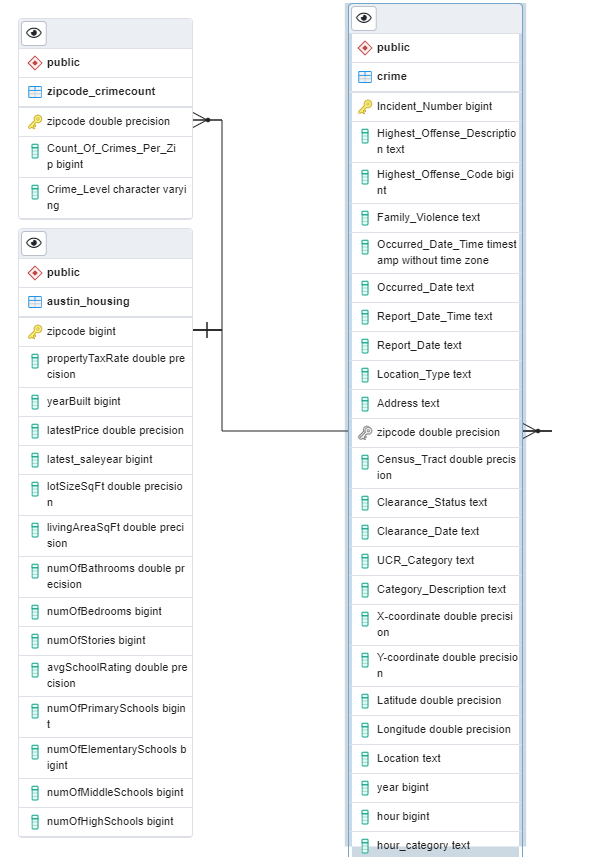
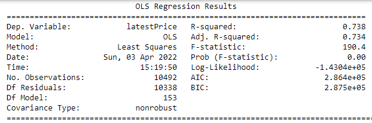

# Housing Prices and Neighborhood Safety in Austin

## Background: 
Housing prices in Austin have seen a sharp increase in recent years. According to the [Austin Board of Realtors January 2022 report](https://www.abor.com/january-2022-central-texas-housing-market-report), the median house price in the Austin-Round Rock area is $476,000, up 30% from last January of 2021. Simultaneously, in recent years there have been reports of increased crime in Austin. According to [KVUE, there were 60 homicides in Austin in 2021](https://www.kvue.com/article/news/local/austin-homicide-record-number-2021/269-e3c419af-9722-456f-9b5d-c044944e128d), the highest in 61 years that the police has kept records. Taking both things into consideration, we wonder if the crime rates are impacting, if at all, house sales and the price they are listed at. 

## Questions: 
- Can we predict, based on crime data, the price of a house in Austin?
- Will crime rates and house prices vary by zip code based on year?
- Will crime rates in Austin affect house prices by zip code?

## Technologies: 
Information pertaining to the technologies used for this assignment are found in the [technology.md file](technology.md). 

## Data: 
The data used for this project comes from an [Austin House Listing dataset](https://www.kaggle.com/ericpierce/austinhousingprices) found on [kaggle.com](https://www.kaggle.com/), along with a [crime reports dataset](https://data.austintexas.gov/Public-Safety/Crime-Reports/fdj4-gpfu) from [austintexas.gov](https://www.austintexas.gov/). The Austin House Listing dataset contains information pertaining to the housing market from 2018 to 2021. We chose this dataset as it listed houses from multiple zip codes around Austin and it offered insight on the features of each listing, such as: if the house was in a homeowner's association, the nearby schools, and the latest listing price. We will merge this dataset to the crime reports dataset on zip code and determine if the latest listing price for a home could be predicted by the number of crimes and the crime level in a zip code. 

The crime reports dataset contains records of incidents that the Austin Police Department responded to and reported. This dataset is updated weekly; however, the dataset used for this analysis was last updated on 7 March 2022. The raw dataset contains 2.41 million rows of data from 2002 to 2022. We filtered this dataset to contain reported crimes from 2018 to 2020 to align with the housing dataset. An entity relationship diagram for our project is shown below. This diagram displays the relationships between the datasets, including how we plan to merge, and each primary key. 

## Machine Learning Model: 
### Our Model: 
We want to find a relationship between two or more continuous and categorical variables in efforts to determine if crimes in Austin have an effect on the housing prices between 2018 and 2020. We will implement a Multiple Linear Regression, which is a supervised Machine Learning model in which the model will find the best fit linear line between the dependent variable- the latest listing price and the independent variables- the number of crimes per zip code, the crime level occurrence, and a multitude of variables related to the house. This model best fits our data as our data has labels and has the potential to learn, based on the input variables, what the output (latest listing price) might be. Furthermore, by using an ordinary least squares regression technique to evaluate our regression model, we are able to estimate the coefficients of the linear regression equation to identify the relationship and impact each variable has on the latest listing price. However, we are aware of the limitations regarding our model. The main limitation of using a multiple linear regression is assuming limarity between the dependent and independent variables. We are also limited to the variables presented in the selected datasets and to data from 2018 to 2020. The model also does not account for external factors affecting the housing market such as supply shortage and other repercussions of the pandemic. 

### Data Preprocessing: 
After loading our housing dataset as a DataFrame, our initial observation was that the dataset contained houses in surrounding Austin cities. In efforts to limit our analysis to Austin only, we dropped the zip codes pertaining to cities surrounding Austin. 

Furthermore, in our initial analysis we found that there were no null values for this dataset. 

We also dropped two columns deemed unnecessary for our analysis: “latestPriceSource” and “numOfPhotos”.

After looking at the value counts for the "homeType" column, we decided to focus on single family homes only, as it makes up 94% of the housing data. We believed that other home types may skew the model and listing price. 

We then took the minimum and maximum from the 'latest_saledate' column and discovered that for 2021, only January was included. For this reason, we decided to filter our data and only look at data from 2018 to 2020 where a full years’ worth of information was available. 

We also dropped zip codes that had 3 or less home sales per year as three or less sales for a zip code in a year would not aid our analysis. In further efforts to reduce noise in our dataset, we ensured that each zip code had three years (2018, 2019, 2020) worth of data and dropped the zip codes that did not. 

Through sorting and plotting our data, we were able to discover a handful of outliers--a 27 bath, 4 bed house, a $13 million 4,000 square foot house, a less than one million-dollar 30,000 square foot house, and four $8-9 million dollar houses-- that were removed from our dataset. The image below is a graph of living square foot by latest listing price to display the outliers we removed.

 

After loading our crime data and creating a DataFrame, we started by cleaning the column names by replacing the spaces with underscores in the column titles. In anticipation of merging the two datasets, we changed the name of the zip code column from "Zip_Code" to "zipcode" in efforts to match the housing dataset. 

We then filtered the crime data to only include 2018-2020 crimes to further match our housing data. We then dropped columns we collectively deemed unnecessary for our analysis-- "Council_District", "APD_Sector", "APD_District", "PRA", "Occurred_Time", and "Report_Time". 

The crime dataset did contain null values for multiple columns. After discussion, we dropped the null values for the following columns since the columns are necessary for our analysis and replacing the null values would alter our data: "Location_Type", "zipcode", "Census_Tract", and "Latitude". Dropping the null values for the "Latitude" column also removed null values for "Longitude" and "Location". Furthermore, we discovered that dropping null location values also removed all instances of rape crimes in our dataset. We then decided to replace null values for "UCR_Category", "Category_Description", "Clearance_Status", and "Clearance_Date" with unknowns as it applies to the data. A more clear breakdown of what we replaced is displayed in the code below: 

We also changed the "Occurred_Date_Time" column to a datetime data type and extracted the hour in a new column and created categories for Morning, Afternoon, Evening, and Night. We grouped the data by zip code and showed counts of crimes per each time of day, to see if there was any change in crime rates per zip code depending on the time. Below is a graph visualizing the occurence of crime by the time of day. As you can see, the time of day does not tend to influence the rate crimes occur in Austin.

Lastly, we clustered the count of crimes by zip code and categorized each zip code as low, medium, or high crime occurrence. 

### Model Accuracy: 
To accomplish our model, our data was grouped by zip code to count the occurrence of crimes and this DataFrame was merged to the housing data. An initial attempt of our model showed a low adjusted r-squared score of 0.38. In efforts to improve our model, we encoded zip codes and the occurance of crimes (high, medium, low) so each could be evaluated in the model. Furthermore, columns that initially showed insignificant p-values (greater than 0.05) from our inital analysis were dropped. Our data was split into training and testing sets (with train_test_split default parameters) and was further scaled (using StandardScaler()) to improve accuracy. We used sklearn’s LinearRegression to perform our model and statsmodels.api to display the OLS Regression results. After refactoring, the adjusted r-squared score was 0.556. The code used to accomplish our multiple linear regression, including training and scaling our data is shown below. 

Additional refactoring and cleaning were conducted. All categorical features were encoded and additional extreme outliers were identified and removed from the dataset. Our adjusted r-squared score is 0.728 and we find that for each crime occurrence, the latest listing price decreased by $0.2106. 

The remaining OLS summary can be found [here](output.txt)

Furthermore, we displayed the coefficients of each feature in our multiple linear regression to evaluate their effect on the latest listing price. Through the visualization below, we can see that the property tax rate had the most significant effect on the latest listing price. 

### Feature Selection: 
Throughout our analysis, our model choice and dependent variable remained the same-- a Linear Regression and the Latest Listing Price, respectively. However, through multiple attempts at improving our model, we found that including more features from the housing dataset significantly improved our model. As stated previously, we reevaluated our selected columns for the model and encoded columns we originaly assumed as numeric-continuous variables to categorical. Furthermore, we chose to only include the count of crimes per zip code and the level of crime occurance (low, medium, or high) from the crime dataset as other variables related to crime would have required assumptions about the crime (do we deem it high or low danger for example) and other variables woulud have increased the noise in our model. Below is a full list of our selected variables. Those variables italicized were encoded to categorical variables.  
  - *zipcode*
  - *propertyTaxRate*
  - garageSpaces
  - parkingSpaces
  - latestPrice
  - *numPriceChanges*
  - *numOfAccessibilityFeatures*
  - numOfAppliances
  - *numOfParkingFeatures*
  - *numOfPatioAndPorchFeatures*
  - *numOfSecurityFeatures*
  - *numOfWaterfrontFeatures*
  - *numOfWindowFeatures*
  - *numOfCommunityFeatures*
  - lotSizeSqFt
  - livingAreaSqFt
  - *numOfBathrooms*
  - *numOfBedrooms*
  - *numOfStories*
  - *avgSchoolRating*
  - *numOfPrimarySchools*
  - *numOfElementarySchools*
  - *numOfMiddleSchools*
  - *numOfHighSchools*
  - avgSchoolDistance
  - avgSchoolSize
  - *MedianStudentsPerTeacher*
  - Count_Of_Crimes_Per_Zip
  - *Crime_Level*

### Questions Revisited: 
#### Can we predict, based on crime data, the price of a house in Austin?
Our initial Multiple Linear Regression attempted to solve this question based on crime data alone. For this initial analysis we used the count of crimes and the time the crime occured as the only indepentent variables to predict our dependent variable, the latest listing price. This model was not successful alone and resulted in an adjusted P-value of 0.38. With more research, we found that we could not confidently predict the latest listing price based on crime data alone, we did need additional housing variables. Using more variables resulted in our final adjusted p-value of 0.728 and we found the following coefficients related to the crime data. 

#### Will crime rates and house prices vary by zip code based on year?
In order to discover the difference in crime rates and housing prices per year, we grouped both our crime and housing data by zip code and year and calculated the percent difference for each zip code from 2018 to 2019 and 2019 to 2020. The findings from this analysis are sumarized in the visual below. 

Through this visualization, we can see that from 2018 to 2019 there was a general increase in the occurance of crime by zip code; however, from 2019 to 2020, there tends to be a decrease in crimes per zip code. 
For the latest listing price, we see that for each year difference, there tends to be an increase in housing prices for each zip code. 

#### Will crime rates in Austin affect house prices by zip code?
Based on our data, we find that the model explains 72.8% of the change in the latest listing price, leaving 27.2% unexplained by our data. Furthermore, from the visual below where latest listing price is plotted along the y-axis and the count of crimes is plotted on the x-axis, that when there is more crime, there tends to be lower housing prices and when there is less crime, the occurance of higher listing prices is more common. 

## Further Investigation 
If time permitted, we would like to investigate the effect crime grouped by year had on our model. To do this, we would have liked to run three models, one for each year— 2018, 2019, and 2020 in order to investigate the impact each variable had on the latest listing price for each house by zip code by year. 

Additionally, it could have been beneficial to encode each categorical variable (for columns that were dropped during the EDA and cleaning process) to determine its impact on the latest listing price. 

Similarly, it would be interesting to include more crime data to determine if it impacts the latest listing price in any way or changes the weight of the crime occurrence variable.  

We would also like to fine-tune the EDA and cleaning process by categorizing or binning every crime type that was reported.

Lastly, we would have like to include point of interests (such as parks, trails, water-areas, bars, etc.) to see if it would affect the listing price. 

## Database: 
A PostgreSQL database was used to store the cleaned Austin house listing and crime reports datasets. Another table was created from the crime reports dataset for the count of crimes per zip code. A SQL query was written to join the Austin house listing and count of crimes per zip code datasets before importing to Python to use in the machine learning model. The following dependencies will be used to import and export data, and connect to the PostgreSQL database: sqlalchemy and psycopg2.

## Dashboard 
We will be using Tableau as our dashboard. For now, a Public Tableau Dashboard has been created. Ideally, the Dashbord will be formated to look like a scroallable webpage. We will generate various interactive maps within Tableau. Interactivity includes filters for zip codes, years, type of crimes, and many more. Additionally, various graphs and charts created with python's matplotlib and seaborn will be imported to the dashboard. 

# Link to [Tableau dashboard](https://public.tableau.com/app/profile/nayely.gutierrez/viz/CrimeandHousingViz_2/CrimeHousing_Dashboard?publish=yes)
The link above can be used to access our dashboard with detailed visualizations of our data. 

# Link to [Google Slides](https://docs.google.com/presentation/d/1SRrtjqWpumo_CebxympE3YYIjPN8nT7Wi16iODnVgDE/edit#slide=id.gf3b695e621_0_27)
The Google Slides presentation above will be used to explain our project in further detail. 

